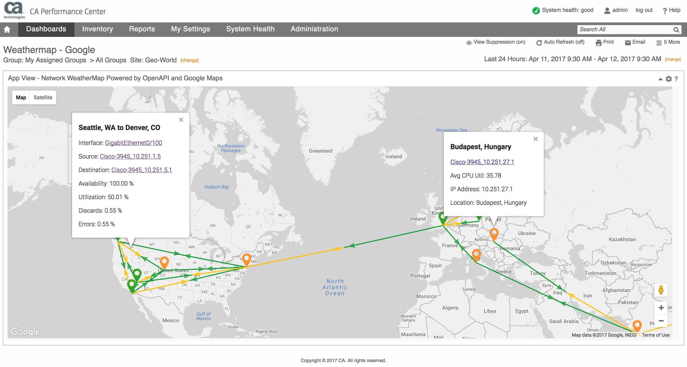

# Network WeatherMap Powered by OpenAPI and Google Maps
An interactive Geo-Map showing devices plotted using Geo-coordinates with interface connections.

#### Install and Configure

1. Download the App from GitHub
2. Install via CAPC App Deployment
3. Add to Dashboard

Note: OOB this app uses the hourly data if you want it more granular you 
can modify the index.html file call for RATE data:
 
Line 75. From: "&resolution=HOUR" +
                To: "&resolution=RATE"
 
Line 89. From: "&resolution=HOUR"
                To: "&resolution=RATE"
                
===================================================================================

License (refer to license.txt in folder for 3rd party license details)

Copyright (c) 2016 CA Technologies
 
The MIT License

Permission is hereby granted, free of charge, to any person obtaining a copy of this software and associated documentation files (the "Software"), to deal in the Software without restriction, including without limitation the rights to use, copy, modify, merge, publish, distribute, sublicense, and/or sell copies of the Software, and to permit persons to whom the Software is furnished to do so, subject to the following conditions:
 
The above copyright notice and this permission notice shall be included in all copies or substantial portions of the Software.
 
THE SOFTWARE IS PROVIDED "AS IS", WITHOUT WARRANTY OF ANY KIND, EXPRESS OR
IMPLIED, INCLUDING BUT NOT LIMITED TO THE WARRANTIES OF MERCHANTABILITY,
FITNESS FOR A PARTICULAR PURPOSE AND NONINFRINGEMENT. IN NO EVENT SHALL THE
AUTHORS OR COPYRIGHT HOLDERS BE LIABLE FOR ANY CLAIM, DAMAGES OR OTHER
LIABILITY, WHETHER IN AN ACTION OF CONTRACT, TORT OR OTHERWISE, ARISING FROM,
OUT OF OR IN CONNECTION WITH THE SOFTWARE OR THE USE OR OTHER DEALINGS IN
THE SOFTWARE.

===================================================================================
=======
#### Modifying the App
>>>>>>> origin/master
